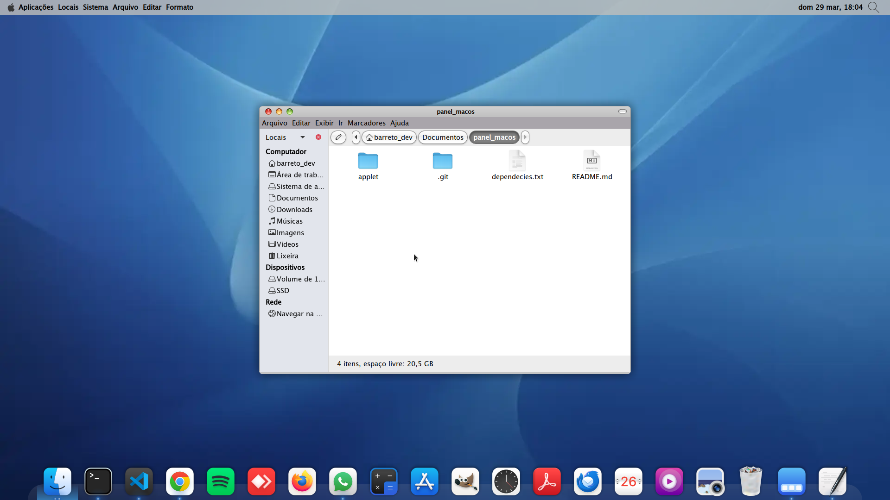
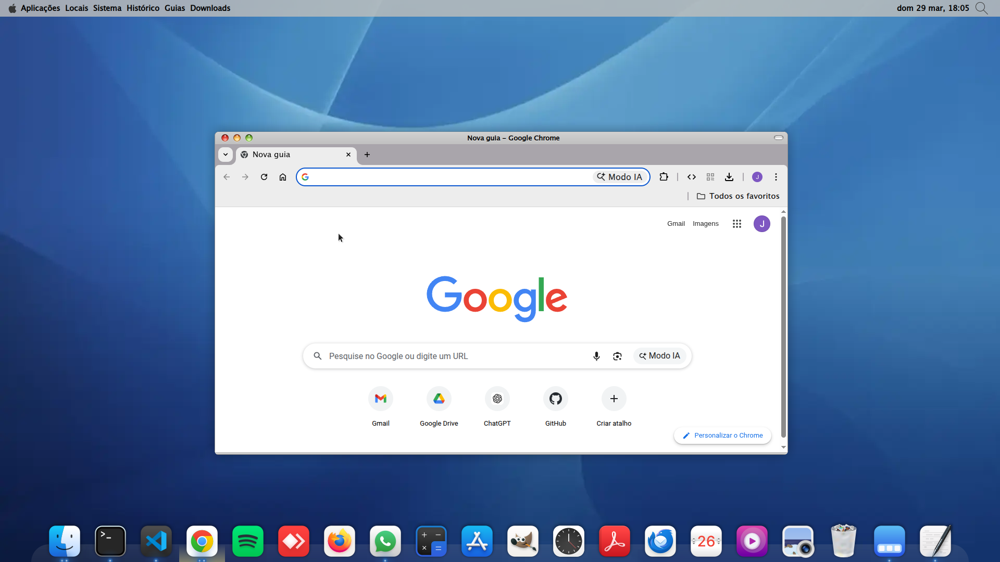
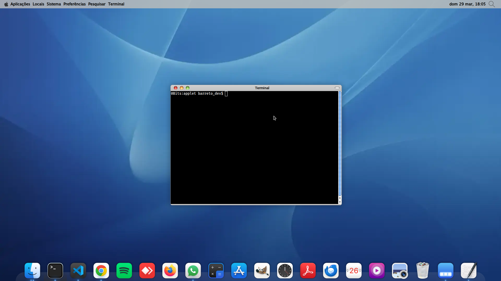

# Applet MacOS Panel

Fala pessoal, tudo bom?  

Bom, desenvolvi esse panel-bar para a interface gráfica **MATE Desktop** com o intuito de trazer uma estética semelhante à barra superior do macOS, com mudanças conforme a janela em foco.  

Porém, diferente do macOS, isso aqui é apenas visual (não funcional). Chega de enrolação — vamos entender o script e depois como instalar.

---

## 🖼️ Exemplos Visuais

### Tela 1


### Tela 2


### Tela 3


---

## 📦 Dependências

Para o script funcionar corretamente:

- `xdotool`

### Configuração adicional (GTK)

Edite o arquivo:

```bash
~/.config/gtk-3.0/gtk.css
```

Abra com:

```bash
nano ~/.config/gtk-3.0/gtk.css
```

E adicione:

```css
mate-panel-menu-bar, #mate-panel-buttons-list {
    font-weight: bold;
}
```

Salve e reinicie o panel:

```bash
killall mate-panel
```

---

## ⚙️ Funções do Script

### 🔹 `getWindowFocus`

Função principal do script.

Ela usa o comando:

```bash
xdotool getwindowfocus getwindowpid | xargs -I {} ps -p {} -o comm=
```

Responsável por identificar o processo da janela em foco atual.

Retorno:
- Nome do processo (string)
- `NULL` em caso de erro

---

### 🔹 `getIdProcessInArray`

Recebe o nome do processo atual e busca dentro de um array de processos.

Retorna:
- O **ID correspondente** ao processo

⚠️ **Importante:**  
Sempre passe o tamanho do array:

```c
int sizeArrayOptions
```

---

### 🔹 `callLabels`

Responsável por retornar os textos exibidos no panel.

- Sempre utilize **3 strings fixas**
- Elas serão exibidas lado a lado

Recebe:
- ID do processo encontrado

Retorna:
- Conjunto de labels correspondente

💡 Dica: mantenha a ordem alinhada com `optionsProcess` para facilitar manutenção.

---

### 🔹 `optionsProcess`

Retorna o array com os processos monitorados.

Para adicionar um novo:

1. Descubra o nome do processo (via terminal ou gerenciador)
2. Adicione no array
3. Adicione também as labels em `callLabels`

⚠️ **Regra importante:**
- Sempre adicione antes do `caja` (default)
- Atualize o `default id` para o último item

---

## 🚀 Instalação

### 1️⃣ Compilar

```bash
gcc applet-macos-panel.c -o seu_executavel
```

---

### 2️⃣ Adicionar ao painel

1. Clique com o botão direito no painel
2. Selecione **"Adicionar ao painel"**
3. Escolha **"Comando"**
4. Insira:

```bash
/home/seu_usuario/caminho_para_seu_executavel
```

💡 Alternativa: usar um `.sh` com esse caminho (mesma coisa)

---

### 🎯 Ajuste final

Agora é só posicionar no painel como preferir.

---

## 🙌 Final

Obrigado por instalar o Applet!

Se quiser contribuir ou tiver dúvidas, entre em contato comigo.  
Minhas redes e email estão no perfil.

Vou continuar trazendo melhorias sempre que possível. 🚀
